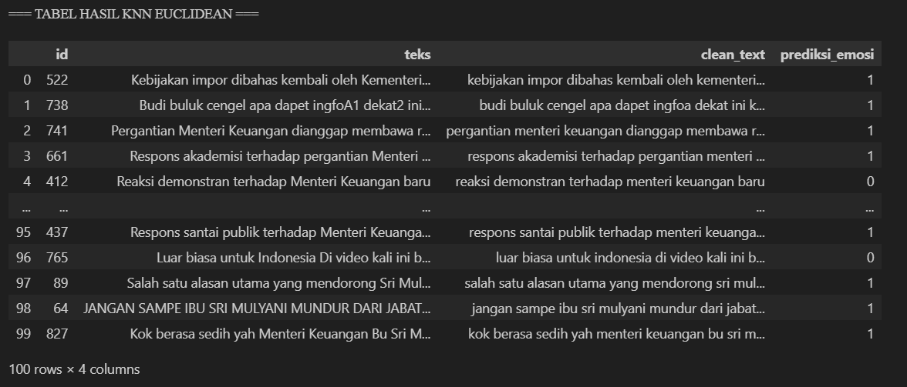
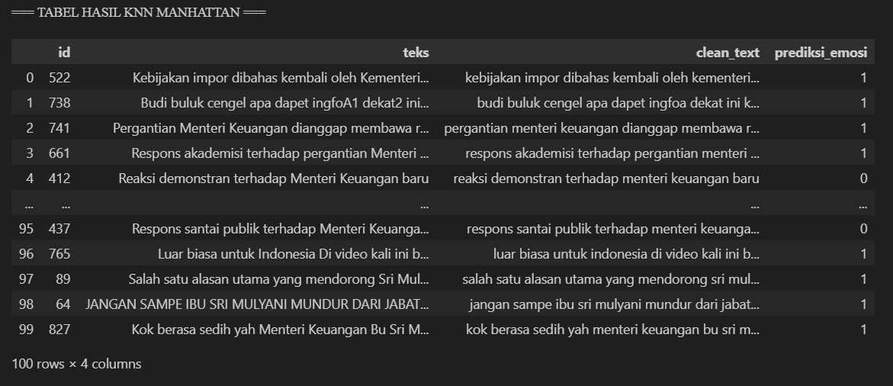
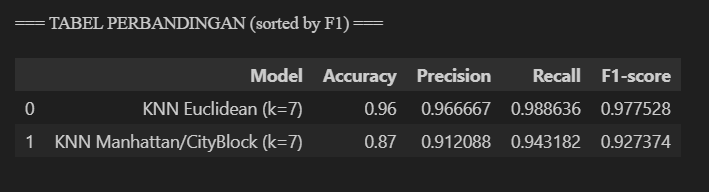

# Sentiment Analysis using K-Nearest Neighbor (KNN)

This project is a machine learning-based sentiment analysis that classifies public opinions regarding the replacement of the Minister of Finance.

The focus of this project is to implement **Natural Language Processing (NLP)** techniques and apply the **K-Nearest Neighbor (KNN)** algorithm for text classification.

---

## Project Objective

* Classify public sentiment into:

  * Positive
  * Negative
  * Neutral
* Analyze public perception from textual data
* Implement machine learning for real-world case study

---

## Features

* Text preprocessing (cleaning, tokenization, normalization)
* Stopword removal
* Feature extraction using TF-IDF
* Sentiment classification using KNN
* Model evaluation (accuracy, confusion matrix)

---

## Tech Stack

* **Language**: Python
* **Libraries**:

  * Pandas
  * NumPy
  * Scikit-learn
  * Matplotlib
  * Seaborn

---

## Methodology

1. Data Collection
2. Data Preprocessing
3. Feature Extraction (TF-IDF)
4. Model Training using KNN
5. Model Evaluation

---

## Results

The model performance was evaluated using accuracy, precision, recall, and F1-score.

### 🔹 KNN with Euclidean Distance
- Accuracy: **96%**
- Precision: **96.6%**
- Recall: **98.8%**
- F1-score: **97.7%**

### 🔹 KNN with City Block (Manhattan) Distance
- Accuracy: **87%**
- Precision: **91.2%**
- Recall: **94.3%**
- F1-score: **92.7%**

---

## 📈 Key Insights

- KNN with **Euclidean Distance significantly outperformed** City Block Distance across all evaluation metrics.
- The model achieved **high recall (98.8%)**, indicating strong ability to correctly identify sentiment classes.
- Euclidean Distance proved to be more effective for text classification using TF-IDF features in this case.
- There were **differences in prediction results on 11 data points** between the two distance methods.

---

## Output Example

---

## What I Learned

* Text preprocessing techniques in NLP
* Implementing KNN for classification
* Evaluating machine learning models
* Working with unstructured text data

---

## Author

**Kevin Wilmer Vittorio**
[kevinwilmerv07@gmail.com](mailto:kevinwilmerv07@gmail.com)

---

## Notes

This project is created for learning and portfolio purposes.
